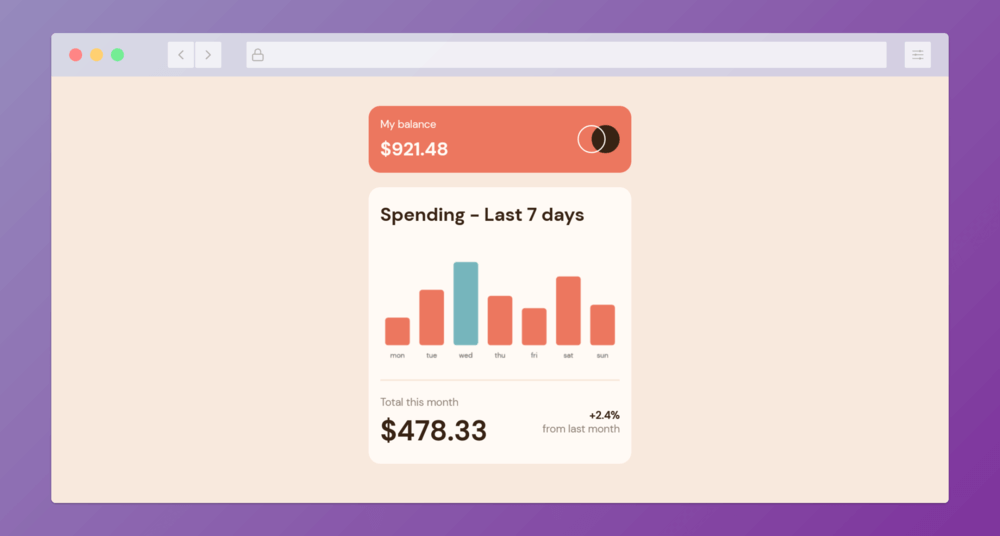

# Frontend Mentor - Expenses chart component [Solución]

Este repositorio es mi solución al [Expenses chart component challenge](https://www.frontendmentor.io/challenges/expenses-chart-component-e7yJBUdjwt) de Frontend Mentor.

El reto consiste en crear un componente que muestre la información de gastos de los últimos 7 días en un gráfico de barras. La información a mostrar es traída desde un archivo JSON y la barra que corresponda al día actual debe tener un estilo diferente al resto.

## Screenshot



## Tabla de contenidos

- [Screenshot](#screenshot)
- [Links](#links)
- [Mi proceso](#mi-proceso)
  - [Construido con](#construido-con)
  - [Lo que aprendí](#lo-que-aprendí)
  - [Lo que se puede mejorar](#lo-que-se-puede-mejorar)
  - [Recursos útiles](#recursos-útiles)
- [Autor](#autor)

## Links

- Solution URL: [Frontend Mentor](https://www.frontendmentor.io/solutions/expenses-chart-component-chartjs-u9fw6bf1I_)
- Live Site URL: [Github page](https://javieer57.github.io/FEM-expenses-chart-component/)

## Mi proceso

### Construido con

- HTML5 semántico
- CSS custom properties
- Flexbox
- Mobile-first workflow
- [Chart.js](https://www.chartjs.org/) - Librería JavaScript para crear gráficos
- [SMACSS](http://smacss.com/) - Metodología CSS

### Lo que aprendí

El aprendizaje que más destaco durante este reto es el uso de Chart.js para mostrar información en gráficos. No solo tuve un primer acercamiento a esta herramienta sino que también aprendí a hacer las configuraciones necesarias para que el componente luciera como el diseño propuesto.

La configuración fue la parte más difícil durante este reto debido a que no sabía hasta qué punto era personalizable Chart.js (la forma en la que se muestra el tooltip, la forma y colores que pueden tener los gráficos, ocultar las líneas de los ejes, etc.):

```js
const chartConfig = {
	type: 'bar',
	data: {
		labels: daysArray,
		datasets: [
			{
				data: amountsArray,
			},
		],
	},
	options: {
		layout: {
			padding: {
				top: 40,
			},
		},
		borderRadius: 5,
		borderSkipped: false,
		scales: {
			x: {
				grid: {
					display: false,
					drawBorder: false,
				},
			},
			y: {
				display: false,
			},
		},
		plugins: {
			legend: {
				display: false,
			},
			tooltip: {
				titleColor: 'rgb(255, 250, 245)',
				bodyColor: 'rgb(255, 250, 245)',
				titleAlign: 'center',
				padding: 10,
				caretSize: 0,
				caretPadding: 10,
				xAlign: 'center',
				yAlign: 'bottom',
				displayColors: false,
				bodyFont: { weight: 'bold', size: 16 },
				callbacks: {
					title: function () {},
					label: function (context) {
						return `\$${context.raw}`;
					},
				},
			},
		},
	},
};
```

Algo que me facilitó la personalización de los colores para el gráfico de barras fueron las `scriptable-options`. Esta característica me permitió reducir el código para cambiar el color de las barras dependiendo el día:

```JS
// dentro de options

backgroundColor: function (context) {
  const index = context.dataIndex;

  return index == currentDay ? currentDayColor : dayColor;
},

hoverBackgroundColor: function (context) {
  const index = context.dataIndex;

  return index == currentDay ? currentDayHoverColor : daysHoverColor;
},
```

Procuré el uso de etiquetas semánticas de HTML para mejorar la accesibilidad, pero al incluir el gráfico de barras con `<canvas>` me surgió la duda de cómo hacer que este elemento fuera accesible para lectores de pantalla.

Afortunadamente, la misma documentación de Chart.js contiene el link a un artículo que te muestra cómo se puede hacer un elemento `<canvas>` accesible y, como resultado, incluí una tabla con la información del gráfico de barras que no es visible directamente en la pantalla (gracias a la clase `is-hidden`) pero que se mantiene dentro del maquetado del sitio.

```html
<canvas id="myChart">
	The text alternative for this canvas bar graphics is in the data table below.
</canvas>

<table
	summary="This is the text alternative for the canvas bar graphics."
	class="is-hidden"
>
	<caption>
		Bar charts for the last seven days' spending.
	</caption>
	<tbody>
		// Information about the table
	</tbody>
</table>
```

```css
.is-hidden {
	border: 0;
	clip: rect(1px 1px 1px 1px); /* IE6, IE7 */
	clip: rect(1px, 1px, 1px, 1px);
	height: 1px;
	margin: -1px;
	overflow: hidden;
	padding: 0;
	position: absolute;
	width: 1px;
}
```

### Lo que se puede mejorar

Sigo experimentando con diferentes formas de escribir CSS porque quiero encontrar una que me haga sentir realmente cómodo.

Durante el reto tuve un primer acercamiento a la metodología SMACSS y me hizo sentido la forma que tiene para organizar las clases. Me gustaría seguir trabajando con esta metodología ya que no estoy seguro de haberla implementado correctamente por ser mi primer intento.

Siento que mi archivo `main.js` está un poco desorganizado porque he puesto la mayor parte de mi atención a la organización del HTML y el CSS. Espero mejorar mi forma de escribir y organizar código JS para futuros proyectos.

### Recursos útiles

- [Chart.js Accessibility](https://www.chartjs.org/docs/latest/general/accessibility.html) - Esta sección da una guía básica de cómo abordar la accesibilidad en elementos `<canvas>`.
- [HTML \<canvas> Accessibility](https://pauljadam.com/demos/canvas.html) - Este artículo profundiza en la accesiblidad con al trabajar con gráficos en páginas web.
- [How to improve web accessibility by hiding elements](https://www.nomensa.com/blog/how-improve-web-accessibility-hiding-elements) - Este artículo ofrece algunas opciones para ocultar elementos a la vista del usuario sin perder su acceso a través de lectores de pantalla.

## Autor

- Portafolio - https://javieereufracio.com
- Github - [@Javieer57](https://github.com/Javieer57)
- Codepen - [@e_javieer](https://codepen.io/e_javieer)
- Frontend Mentor - [@Javieer57](https://www.frontendmentor.io/profile/Javieer57)
